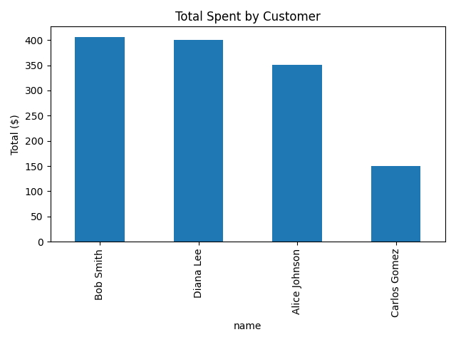
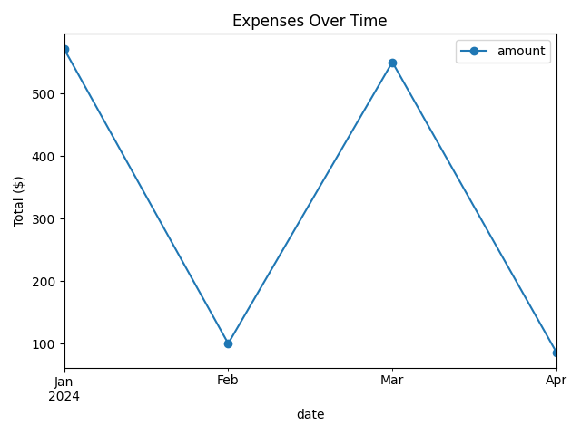

# Customer Orders Data Analysis by Dan Bedoya

This project combines **SQLite + Python (pandas + matplotlib)** to analyze customer orders.  
It demonstrates SQL queries, data manipulation, and visualization — a common workflow for data analysts.

## 📁 Project Structure

SQL-project-customer-orders/
│
├── customer_insights.db # SQLite database with sample tables
├── analysis_sqlite.py # Python script for analysis and visualization
├── images/
│ ├── total_by_customer.png
│ └── expenses_over_time.png
└── README.md

## ⚙️ How It Works
- The SQLite database contains two tables:  
  **customers** (`customer_id`, `name`, `age`, `city`)  
  **orders** (`order_id`, `customer_id`, `date`, `amount`)
- The Python script:
  - Connects to the SQLite database.
  - Reads tables into pandas DataFrames.
  - Calculates:
    - Total amount spent per customer.
    - Monthly expenses summary.
  - Saves two charts into the `images/` folder.

## 🧠 Skills Demonstrated
- SQL (table creation, joins, aggregation)
- Python (pandas, matplotlib)
- Data visualization and reporting
- Basic data workflow automation

## 📸 Sample Output

**1️⃣ Total Spent by Customer**

**2️⃣ Expenses Over Time**

---

👨‍💻 *Created by Dan Bedoya*
